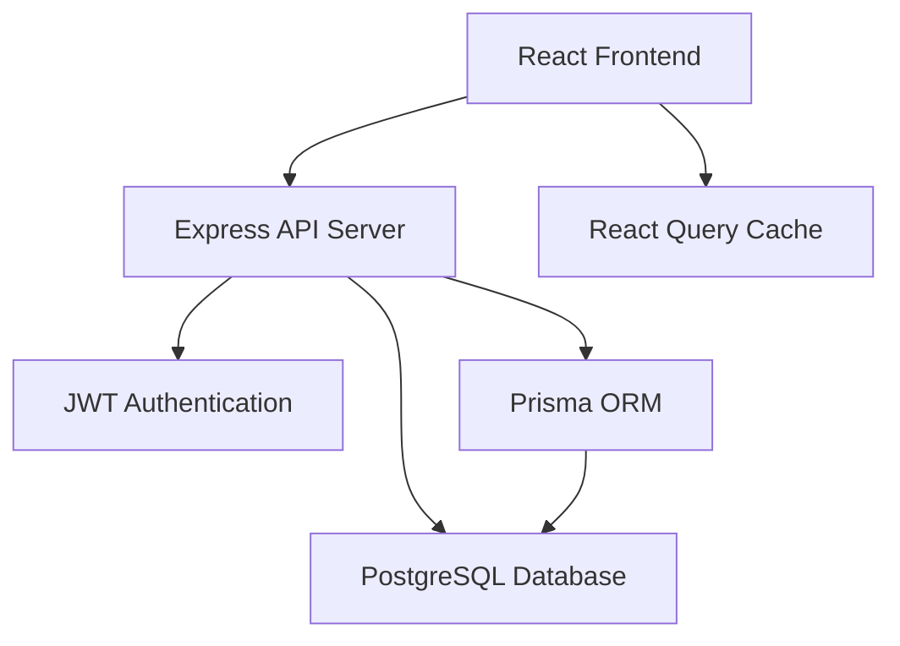

# Design Document

## Overview

The Corporate Asset Management System follows a modern three-tier architecture with a React frontend, Node.js/Express backend API, and PostgreSQL database. The system implements JWT-based authentication, role-based access control, and RESTful API design patterns to provide a scalable and maintainable solution for corporate asset tracking.

## Architecture

### High-Level Architecture



### Technology Stack

- **Frontend**: React 18 with TypeScript, Tailwind CSS, React Router, React Query
- **Backend**: Node.js with Express, TypeScript, JWT authentication
- **Database**: PostgreSQL with Prisma ORM
- **Development**: Docker Compose for containerized development environment

## Components and Interfaces

### Frontend Components

#### Authentication Layer
- **AuthContext**: Manages user authentication state, token storage, and login/logout functionality
- **ProtectedRoute**: Higher-order component that ensures authenticated access to protected pages
- **Login Component**: Handles user authentication with email/password form

#### Core Application Components
- **Layout**: Provides consistent navigation, header, and user information display
- **Dashboard**: Displays asset statistics and recent activity overview
- **AssetList**: Shows paginated list of assets with search, filter, and creation capabilities
- **UserProfile**: Displays user information and assigned assets

#### Shared UI Components
- **Navigation**: Role-based menu system with appropriate access controls
- **Forms**: Reusable form components with validation and error handling
- **StatusBadges**: Consistent status display components for assets

### Backend API Structure

#### Authentication Endpoints
- `POST /api/auth/login` - User authentication
- `POST /api/auth/register` - User registration (admin only)

#### Asset Management Endpoints
- `GET /api/assets` - Retrieve all assets with filtering
- `POST /api/assets` - Create new asset (manager/admin only)
- `PATCH /api/assets/:id/assign` - Assign/unassign asset (manager/admin only)
- `PUT /api/assets/:id` - Update asset details (manager/admin only)

#### User Management Endpoints
- `GET /api/users` - List all users (manager/admin only)
- `GET /api/users/me` - Get current user profile
- `PUT /api/users/me` - Update current user profile

### Middleware Components

#### Authentication Middleware
- **authenticateToken**: Validates JWT tokens and attaches user information to requests
- **requireRole**: Enforces role-based access control for specific endpoints

#### Validation Middleware
- **Input Validation**: Uses Zod schemas to validate request bodies and parameters
- **Error Handling**: Centralized error handling with appropriate HTTP status codes

## Data Models

### User Model
```typescript
interface User {
  id: string;
  email: string;
  name: string;
  password: string; // hashed
  role: 'ADMIN' | 'MANAGER' | 'USER';
  createdAt: Date;
  updatedAt: Date;
  assignedAssets: Asset[];
}
```

### Asset Model
```typescript
interface Asset {
  id: string;
  name: string;
  description?: string;
  serialNumber?: string;
  category: 'HARDWARE' | 'SOFTWARE' | 'FURNITURE' | 'VEHICLE' | 'OTHER';
  status: 'AVAILABLE' | 'ASSIGNED' | 'MAINTENANCE' | 'RETIRED' | 'LOST';
  purchaseDate?: Date;
  purchasePrice?: number;
  vendor?: string;
  location?: string;
  assigneeId?: string;
  assignee?: User;
  createdById: string;
  createdBy: User;
  createdAt: Date;
  updatedAt: Date;
  maintenanceRecords: MaintenanceRecord[];
}
```

### MaintenanceRecord Model
```typescript
interface MaintenanceRecord {
  id: string;
  assetId: string;
  description: string;
  cost?: number;
  date: Date;
  createdAt: Date;
}
```

### Database Schema Design

#### Relationships
- Users can have many assigned assets (one-to-many)
- Users can create many assets (one-to-many)
- Assets can have many maintenance records (one-to-many)
- Assets belong to one assignee (many-to-one, optional)

#### Indexes
- Unique index on user email
- Unique index on asset serial number (when provided)
- Index on asset status for filtering
- Index on asset category for filtering
- Index on asset assigneeId for assignment queries

## Error Handling

### Frontend Error Handling
- **Network Errors**: Display user-friendly messages for connection issues
- **Authentication Errors**: Automatic redirect to login page on token expiration
- **Validation Errors**: Display field-specific error messages from API responses
- **Permission Errors**: Show appropriate access denied messages

### Backend Error Handling
- **Validation Errors**: Return 400 status with detailed field validation messages
- **Authentication Errors**: Return 401 status for invalid/missing tokens
- **Authorization Errors**: Return 403 status for insufficient permissions
- **Not Found Errors**: Return 404 status for non-existent resources
- **Server Errors**: Return 500 status with generic error messages (log detailed errors)

### Error Response Format
```typescript
interface ErrorResponse {
  error: string;
  details?: string[];
  field?: string; // for validation errors
}
```

## Testing Strategy

### Frontend Testing
- **Unit Tests**: Test individual components with React Testing Library
- **Integration Tests**: Test component interactions and API integration
- **E2E Tests**: Test complete user workflows with Cypress or Playwright

### Backend Testing
- **Unit Tests**: Test individual functions and middleware with Jest
- **Integration Tests**: Test API endpoints with supertest
- **Database Tests**: Test Prisma models and queries with test database

### Test Data Management
- **Fixtures**: Predefined test data for consistent testing
- **Database Seeding**: Automated test data setup and teardown
- **Mock Services**: Mock external dependencies for isolated testing

## Security Considerations

### Authentication Security
- JWT tokens with appropriate expiration times (24 hours)
- Secure password hashing with bcrypt (10+ salt rounds)
- Token validation on all protected endpoints

### Data Security
- Input validation and sanitization on all endpoints
- SQL injection prevention through Prisma ORM
- XSS prevention through proper data encoding
- CORS configuration for allowed origins

### Access Control
- Role-based permissions enforced at API level
- Frontend route protection for user experience
- Principle of least privilege for user roles

## Performance Considerations

### Frontend Performance
- React Query for efficient data caching and synchronization
- Lazy loading for large asset lists
- Optimistic updates for better user experience
- Component memoization for expensive renders

### Backend Performance
- Database indexing for common query patterns
- Pagination for large data sets
- Connection pooling for database efficiency
- Response compression for reduced bandwidth

### Caching Strategy
- Client-side caching with React Query
- Database query optimization with Prisma
- Static asset caching with appropriate headers

## Deployment Architecture

### Development Environment
- Docker Compose with separate containers for frontend, backend, and database
- Hot reloading for development efficiency
- Environment variable configuration

### Production Considerations
- Container orchestration with Docker Swarm or Kubernetes
- Load balancing for high availability
- Database backup and recovery procedures
- SSL/TLS encryption for all communications
- Environment-specific configuration management